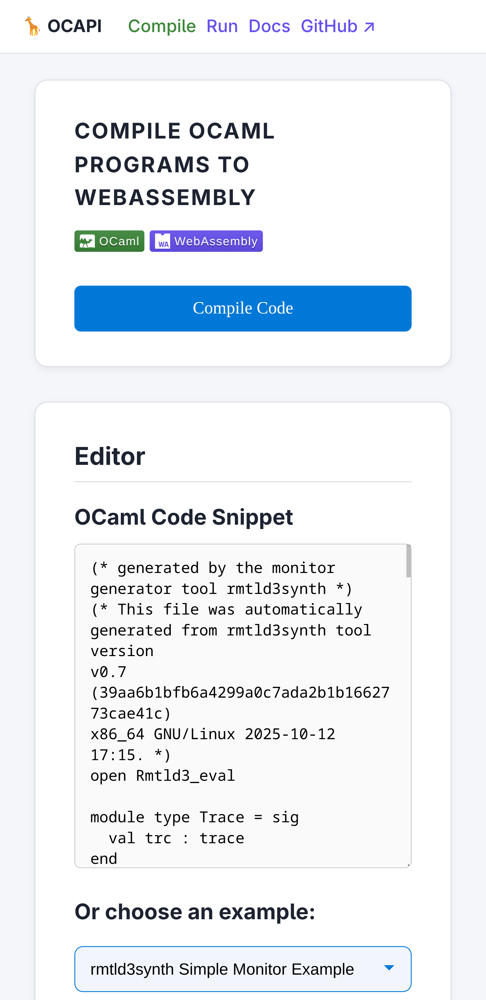
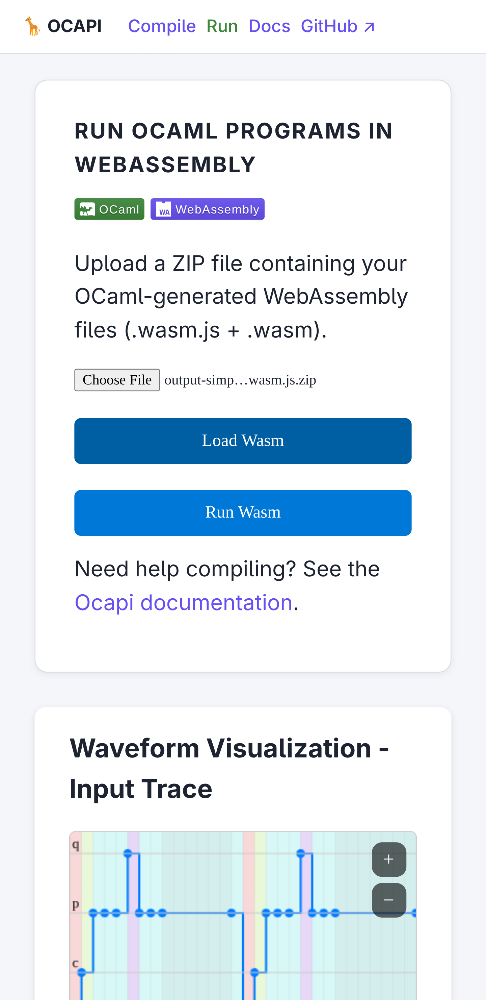
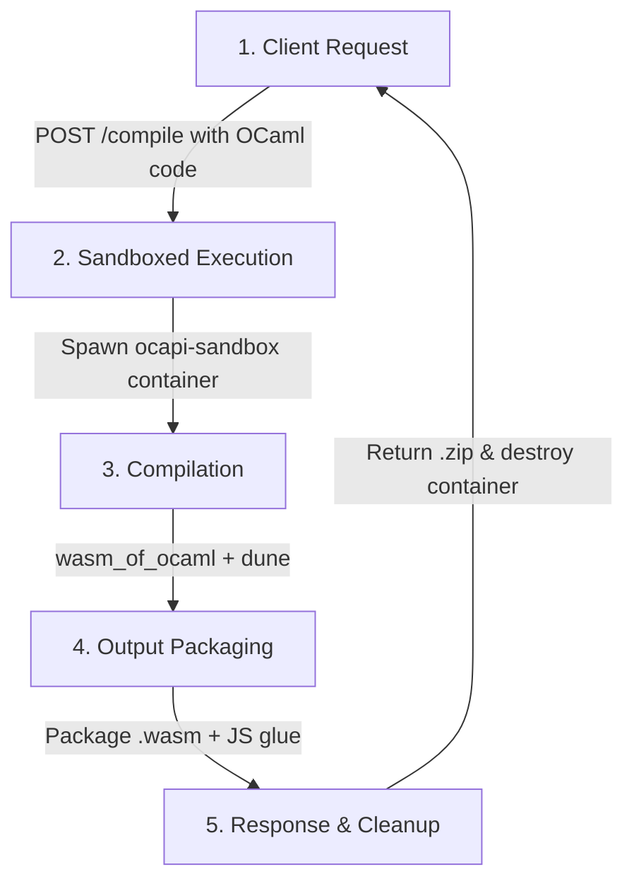

# OCAPI: OCaml → Wasm Compiler API

🦒 Compile OCaml programs to WebAssembly (`.wasm`) online using a secure, containerized API.


[](LICENSE)

|  |  |
|--|--|
| |  |


## 🚀 Quick Start

### 1️⃣ Build the Compilation Sandbox

```bash
docker build --load -t ocapi-sandbox -f Containerfile.sandbox .
```

### 2️⃣ Build ocapi Server

### Docker

```bash
docker build --load -t ocapi -f Containerfile .
docker run -p 8080:8080 -v /var/run/docker.sock:/var/run/docker.sock ocapi
```

### Docker Compose

Create a `docker-compose.yml` file:

```yaml
version: "3.9"
services:
    ocapi:
        image: ghcr.io/anmaped/ocapi:latest
        container_name: ocapi
        ports:
            - "8080:8080"
        volumes:
            - /var/run/docker.sock:/var/run/docker.sock
        security_opt:
            - no-new-privileges:true
        restart: unless-stopped
```

Then deploy:

```bash
docker compose up -d
docker compose logs -f ocapi
```

To stop and destroy containers:

```bash
docker compose down
```

### Podman

```bash
systemctl --user start podman.socket
ls $XDG_RUNTIME_DIR/podman/podman.sock
# Example output: /run/user/1000/podman/podman.sock
```

Now, run the prebuilt image from the GitHub Container Registry (ghcr.io/anmaped/ocapi):

```
podman run --rm -d --security-opt label=disable --name ocapi-container -p 8080:8080 --net host -v /run/user/1000/podman/podman.sock:/var/run/docker.sock ghcr.io/anmaped/ocapi:latest
```

Alternatively, you can build the OCAPI server locally using Podman with the following command:

```bash
podman build -t ocapi -f Containerfile .
```

### 3️⃣ Test OCAPI Server API

```bash
curl -X POST http://localhost:8080/compile \
     -H "Content-Type: application/json" \
     -d '{"code": "print_endline \"Hello WebAssembly!\""}' \
     --output output.wasm.js.zip
```

> `output.wasm.js.zip` now contains your compiled WebAssembly module and the glue JS code.

---

## 🔧 How It Works

**Workflow Overview:**



**Workflow Steps:**

1. **Client Request** — The client sends OCaml source code via a POST request to `/compile`.
2. **Sandboxed Execution** — The REST API spawns a temporary, isolated container using the `ocapi-sandbox` image.
3. **Compilation** — Inside the container, `wasm_of_ocaml` and `dune` compile the OCaml code to WebAssembly.
4. **Output Packaging** — The resulting `.wasm` module and JavaScript glue code are packaged into a `.zip` archive.
5. **Response & Cleanup** — The compiled assets (or compilation errors) are returned to the client, and the container is destroyed.

---

## ⚠️ Important Notes

* Requires a running Docker or Podman daemon (socket must be mountable).
* Each request compiles in an ephemeral, isolated container; it is removed after completion.
* Only OCaml projects using `dune` (and `opam` for deps) are supported.
* Produced artifacts (.wasm + JS glue) are zipped and streamed back; nothing is persisted.
* Enforce reasonable CPU / memory / time limits to mitigate abuse (adjust in server config).
* Avoid embedding secrets in submitted code; the sandbox is intended for untrusted snippets.

---

## Development & Contributing

We welcome contributions! Follow this workflow:

### 1️⃣ Clone the Repository

```bash
git clone https://github.com/anmaped/ocapi.git
cd ocapi
```

### 2️⃣ Setup Environment (using `.devcontainer`)

```bash
eval $(opam env)
dune build
```

### 3️⃣ Run the Server Locally

```bash
dune exec ./server.exe
```

### 4️⃣ Run Tests

```bash
dune runtest
```

### 5️⃣ Submit Changes

1. Create a branch:

```bash
git checkout -b feature/my-new-feature
```

2. Make your changes and commit:

```bash
git add .
git commit -m "Add my feature"
```

3. Push and create a pull request:

```bash
git push origin feature/my-new-feature
```


### Contribution Tips

* Ensure your code passes `dune runtest` before submitting.
* Use descriptive commit messages.
* Update the README if your change affects usage or deployment.

