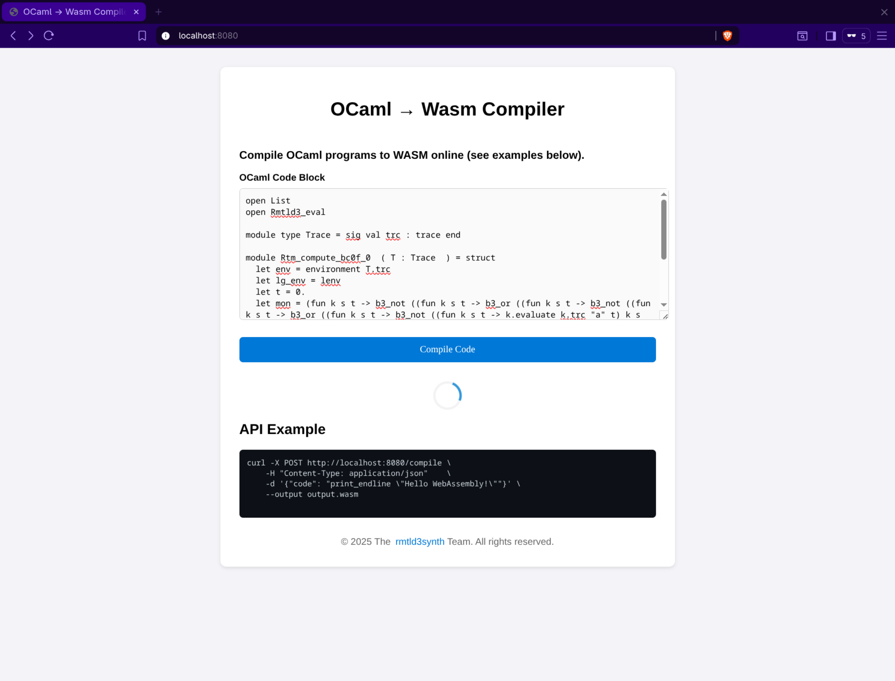
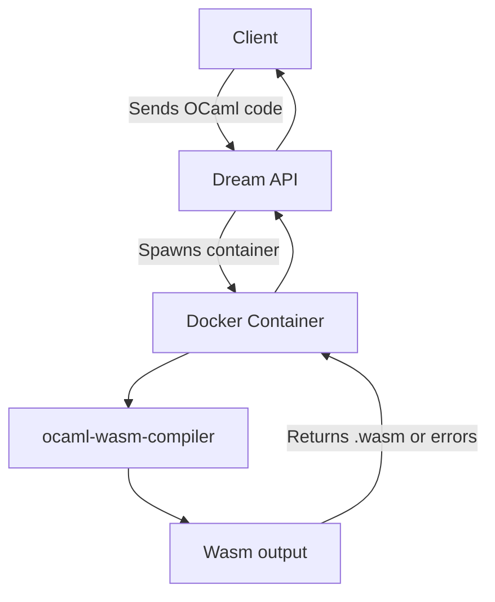

# OCAPI: OCaml → Wasm Compiler API

🦒 Compile OCaml programs to WebAssembly (`.wasm`) online using a secure, containerized API.


[](LICENSE)



## 🚀 Quick Start

### 1️⃣ Build the Compilation Sandbox

```bash
docker build --load -t ocaml-wasm-compiler -f Containerfile.sandbox .
```

### 2️⃣ Build ocapi Server

### Docker

```bash
docker build --load -t ocapi -f Containerfile .
docker run -p 8080:8080 -v /var/run/docker.sock:/var/run/docker.sock ocapi
```

### Podman

```bash
systemctl --user start podman.socket
ls $XDG_RUNTIME_DIR/podman/podman.sock
# Example output: /run/user/1000/podman/podman.sock
```

```bash
podman build -t ocapi -f Containerfile .
podman run --rm -d -p 8080:8080 --net host -v /run/user/1000/podman/podman.sock:/var/run/docker.sock ocapi
```

### 3️⃣ Test OCAPI Server

```bash
curl -X POST http://localhost:8080/compile \
     -H "Content-Type: application/json" \
     -d '{"code": "print_endline \"Hello WebAssembly!\""}' \
     --output output.wasm.js.zip
```

> `output.wasm.js.zip` now contains your compiled WebAssembly module and the glue JS code.

---

## How It Works



* The client sends OCaml code to the API.
* The Dream API spins up a temporary Docker container.
* The container compiles the OCaml code to WebAssembly.
* The compiled `.wasm` (or errors) is returned to the client.

---

## ⚠️ Notes

* Docker or Podman must be installed and running.
* Compilation is sandboxed for security.
* Compatible with standard OCaml projects using `dune` and `opam`.

---

## Development & Contributing

We welcome contributions! Follow this workflow:

### 1️⃣ Clone the Repository

```bash
git clone https://github.com/anmaped/ocapi.git
cd ocapi
```

### 2️⃣ Setup Environment (using `.devcontainer`)

```bash
eval $(opam env)
dune build
```

### 3️⃣ Run the Server Locally

```bash
dune exec ./server.exe
```

### 4️⃣ Run Tests

```bash
dune runtest
```

### 5️⃣ Submit Changes

1. Create a branch:

```bash
git checkout -b feature/my-new-feature
```

2. Make your changes and commit:

```bash
git add .
git commit -m "Add my feature"
```

3. Push and create a pull request:

```bash
git push origin feature/my-new-feature
```


### Contribution Tips

* Ensure your code passes `dune runtest` before submitting.
* Use descriptive commit messages.
* Update the README if your change affects usage or deployment.

